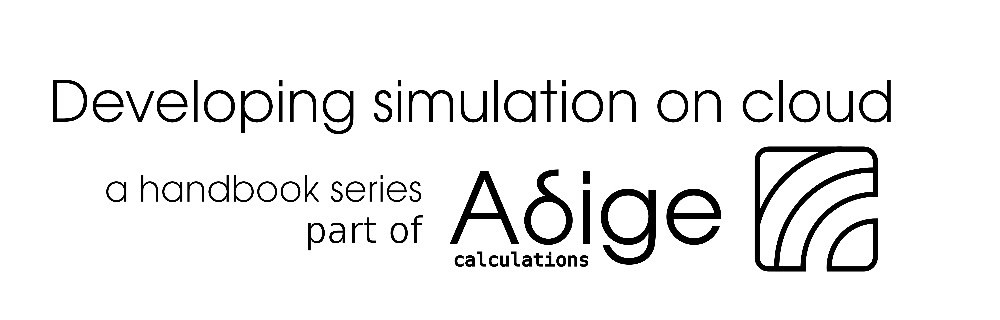

[](https://www.adigecalculations.com/)

# Preface
-----------------------------------------------------------

This repo contains the workflow we use to develop simulation on the web. It acts as
a guide for doing some really neat things. However, keep in mind it should be seen 
as a co-pilot for your development activities,instead of a place to study on.

It is intended to support engineers or students interested in developing
simulations for the web. It provides explanations and extension we find
useful during our workflow here in Adige, and it is designed to be used via keywords
search. This will allow you to enrich or resolve a problem in the shortest possible time.

--------------------------------------------------------------

## How to interpret the text:

| Structure    | Meaning             |
| -----------  | ------------------- |
| Abc          | Normal text         |
|``` Abc```    | Shell command       |
|```<Abc>```   | User input required |

