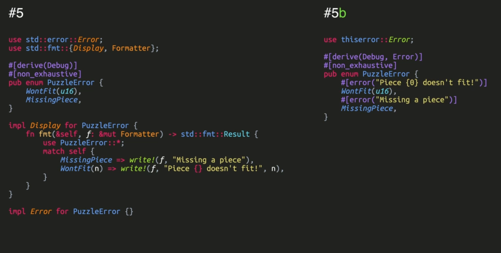

# Error generation

|   <b>Rule 1</b> |  An error must be enum |
|   <b>Rule 2</b> |  Group errors as variants until it makes sense, do not be afraid of making long variants   |
|   <b>Rule 3</b> |  Use your self-made errors in your code  |
|   <b>Rule 4</b> |  Your enum must be non exhausitve | 
|   <b>Rule 5</b> |  Create the ```Debug```, ```Display```, ```Error``` trait in this order|


## Rule 2: 
A variant is an enum with mutiple possibility


## Rule 4:  
To be then possible refactor the code adding a new errors

```rust
#[non_exhaustive]
pub enum Error {
    Message(String),
    Other,
}
```

## Rule 5:   
Because the Error trait is defined as a sub trait of Debug and Display

As a reminder, here are the 5 Guidelines for creating an error type:
(1) Use an `enum` for your error type
```rust
pub enum DolphinError {
    LongName,
    TooYoung,
    Hungry,
}
```
(2) Your error conditions should be enum variants grouped in as few enums as makes sense
(3) Don't expose error types other than your own
(4) Make your enum non-exhaustive
```rust
#[non_exhaustive]
pub enum DolphinError {
    LongName,
    TooYoung,
    Hungry,
}
```
(5) Implement the Debug, Display, and Error traits
(5b) You can use thiserror's `Error` macro to derive the Display and Error traits
```rust
use thiserror::Error;

#[derive(Error, Debug)]
#[non_exhaustive]
pub enum DolphinError {
    #[error("The dolphin name is too long")]
    LongName,
    #[error("The dolphin is too young")]
    TooYoung,
    #[error("The dolphin is too hungry")]
    Hungry,
}
```
</img>

A usefull tool is ```anyhow``` which recon if an entitiy has its own set of errors:

- Without anyhow
-----------------------------------------
```rust
fn play_time(dolphin: &Dolphin) -> Result<Vec<String>, DolphinError> {
...
}
```

- With ```anyhow``` in scope
---------------------------------------
``` rust
use anyhow::Result

fn play_time(dolphin: &Dolphin) -> Result<Vec<String>> {
...
}
```
